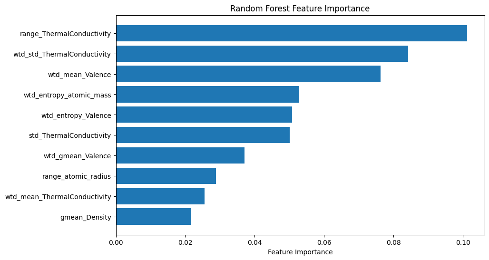
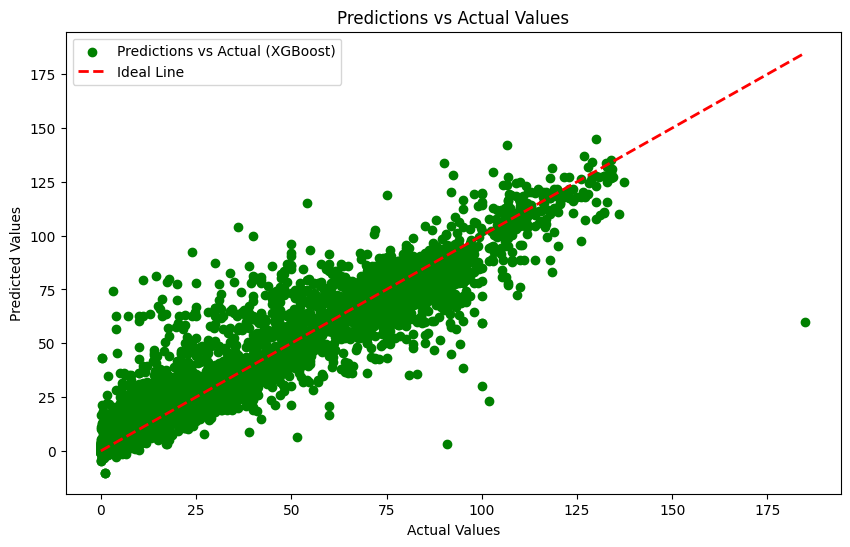

# Superconductors
Superconductors are materials that, when cooled below a certain critical temperature, exhibit zero electrical resistance and expel magnetic fields—a phenomenon known as superconductivity. This property allows superconductors to conduct electricity with unparalleled efficiency and without loss, making them integral components in various technologies, including MRI machines, particle accelerators, and power grid infrastructure.

Predicting the critical temperature of superconductors can help further our understanding of superconductivity and aid in designing and discovering new materials. It is also useful for the advancement of quantum computing technology, which heavily relies on superconductors.

## Predictions
I utilized a range of trees based models to find the best performer at predicting the critical temperature. Random Forests, an ensemble model based on decision trees, and XGBoost, a black-box ensemble model were the best performing ones. For interpretability sake, the Random Forest model should be used going forward. The feature importance tells us which properties in the superconducter have the most predictive power at determining its critical temperature

| Model Name | RMSE | Correlation | Bias |
|----------|----------|----------|----------|
| Random Forest | 9.54 | 0.96 | 0.96 |
| XGBoost | 9.85 | 0.96 | 0.32 |

The code implementation with all the models can be found in `predictions.ipynb`

The dataset was found on the UCI machine learning repository.
